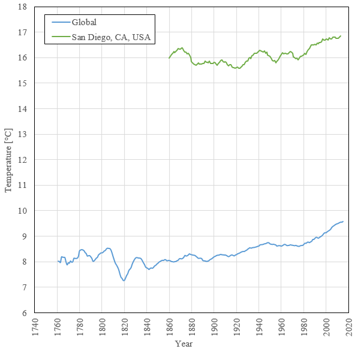

# Explore Weather Trends

This project investigates local and global weather trends using SQL, created as part of the [Data Analyst Nanodegree by Udacity](https://www.udacity.com/course/data-analyst-nanodegree--nd002).

### Skills Demonstrated

- Basic SQL commands and syntax.
- Fundamental data analysis concepts such as communicating logic and conclusions.

####

